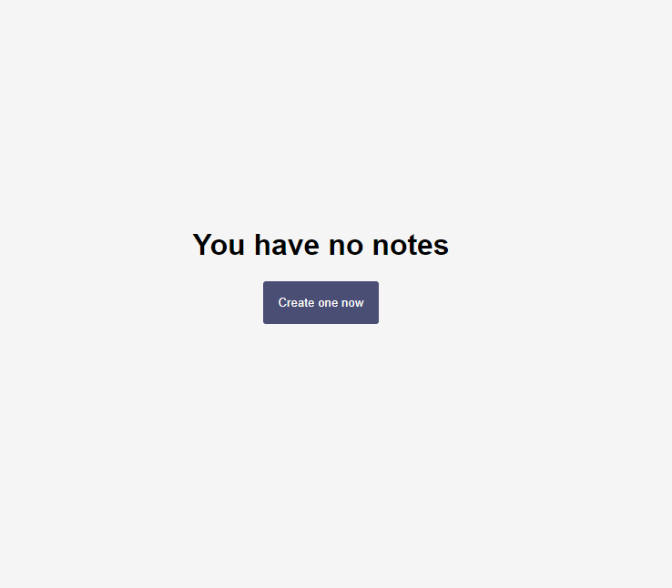

React JS app that accept Note data from the user Interface, and save it on Firebase Database, and get it back to the user interface.

Learn:
- I learn the use of Bouncing Method, for the use of deploying request for a specified amount of time.

